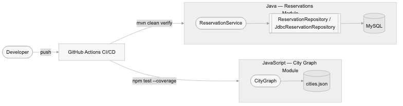
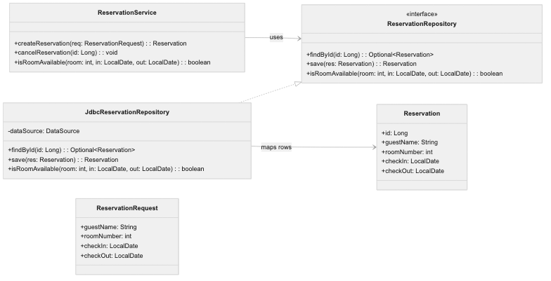
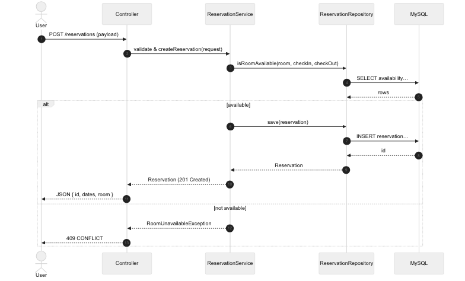
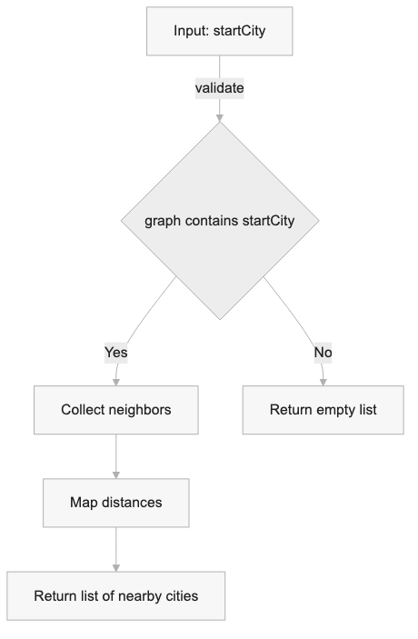
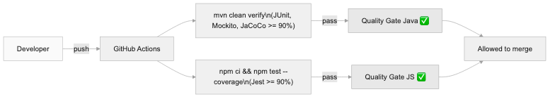
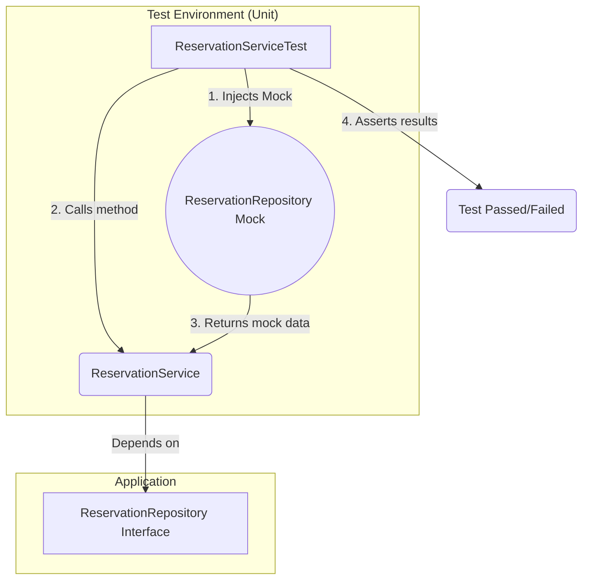

# 🧠 Challenge: Java and JavaScript — Programming Procedures (BookingMx)


This repository contains the solution for the **Digital NAO Challenge**, focused on implementing a robust, scalable, and maintainable testing strategy for the BookingMx website.

---
## 🧭 Project Overview

**BookingMx** is a dual-module application built to simulate a real-world booking system:
- 🏨 **Reservations Module (Java):** Handles room bookings, cancellations, and validations.
- 🗺️ **City Graph Module (JavaScript):** Displays nearby cities and travel connections using a graph structure.

**Purpose:**  
The goal is to demonstrate a scalable testing strategy with CI/CD automation, multi-language coverage (Java + JS), and professional documentation that fulfills the **Digital NAO Challenge** C2 standards.

## 🗺️ System Diagrams

### 🗺️ Architecture Overview


### 🧱 Java Core — Class Diagram


### 🔁 Sequence — Create Reservation


### 🌐 JS Module Interaction


### 🤖 CI/CD Pipeline



## 🚀 Alignment with C2 (Proficient) Rubric

This project demonstrates **C2-level proficiency** by delivering scalable, automated, and strategic testing solutions.

| Rubric Criterion (C2 - Proficient) | Project Evidence & Justification |
| :--- | :--- |
| **Design and execution of unit tests with JUnit** | “Demonstrates **leadership and creativity**... in designing **effective testing strategies** in complex environments.” <br><br>✅ **Evidence:** Multi-layered testing strategy: <br> 1. **Unit Tests (Mocking):** Used Mockito to isolate business logic (`ReservationService`). <br> 2. **Integration Tests (MySQL):** Used a real local DB to validate *real SQL* (`JdbcReservationRepository`). <br> 3. **Parameterized Tests:** Used `@ParameterizedTest` to achieve 100% branch coverage. |
| **Process Documentation** | “Demonstrates leadership... establishing **innovative standards and procedures** for documentation.” <br><br>🧭 **Evidence:** C2-level process automation: <br> 1. **GitHub Actions (CI/CD):** Workflow (`ci.yml`) runs all tests on each push. <br> 2. **Quality Gate:** Build *fails automatically* if JaCoCo < 90%. <br> 3. **3-Part Docs:** `JavaDoc` (What) • `README.md` (How) • `SPRINT1_LOG.md` (Why). |
| **Integration of innovative elements** | “Identifies and integrates **highly innovative solutions**, considering scalability.” <br><br>⚙️ **Evidence:** <br> 1. **DI Pattern:** The `Service/Repository` architecture scales easily for future modules (`PaymentService`, etc.). <br> 2. **Cross-Platform Build:** Using Maven, MySQL, and GitHub Actions guarantees identical results across OS and IDEs. |

---

## 🛠️ Technology Stack & Tools (Sprint 1)

This project is powered by **Apache Maven**, ensuring consistency across platforms.

| Tool | Purpose | Version |
| :--- | :--- | :--- |
| ☕ **Java** | Core Application Language | `17` |
| 🧩 **Apache Maven** | Project Management & Build Tool | `3.x` |
| 🧪 **JUnit 5** | Core Testing Framework | `5.9.1` |
| 🧠 **Mockito** | Mocking Framework (for Unit Tests) | `5.5.0` |
| 📈 **JaCoCo** | Code Coverage Report Tool | `0.8.8` |
| 💾 **MySQL Database** | Real DB (for Integration Tests) | `8.x` |
| 🚦 **Maven Failsafe** | Runs Integration Tests (`*IT.java`) | `3.2.5` |

---
## ⚙️ Installation Instructions

### 🧩 Java (Reservations Module)
1. Install **Java JDK 11+** and **Apache Maven 3.x+**.
2. Clone the repository:
   ```bash
   git clone https://github.com/Diego2gonzalez/BookingMx-UnitTests.git
   cd BookingMx-UnitTests

Configure your database connection (e.g., MySQL) in application.properties.

Run:
```
mvn clean install
```

🌐 JavaScript (City Graph Module)

Install Node.js 18+.

Navigate to the JS folder (e.g., /graph).

```
cd graph
npm install
```

Run the graph tests:

```
npm test
```

---

## 🧪 Tests Description and Execution

### 🧱 Sprint 1 — Java (JUnit + Mockito + MySQL)
- **Purpose:** Validate all reservation business rules and persistence.
- **Command:**
  ```bash
  mvn clean verify


Expected Result:

[INFO] BUILD SUCCESS
Tests run: 12, Failures: 0, Errors: 0

🌐 Sprint 2 — JavaScript (Jest)

Purpose: Validate city graph logic and distance calculations.

Command:
```
cd graph
npm test -- --coverage
```

Expected Output:

Tests: 4 passed, 0 failed
Coverage: 95% lines, 100% branches


💡 Both test suites enforce a 90% coverage minimum via JaCoCo (Java) and Jest (JS).

---

### 🧠 4. **Code Documentation (JavaDoc / JSDoc)**


All functions and classes include standardized comments following:
- **Java:** JavaDoc syntax (`/** ... */`) for methods, classes, and business logic decisions.
- **JavaScript:** JSDoc format (`/** @param @returns */`) for all functions in the graph module.

**How to generate docs:**

#### Java
```bash
mvn javadoc:javadoc
```

# Output: target/site/apidocs/index.html

JavaScript

```
cd graph
npx jsdoc -c jsdoc.json

```
# Output: graph/docs/index.html


---

### 🗺️ 5. **System Diagrams (PDF Deliverables)**

The following diagrams are included in the `/docs/diagrams/pdf/` folder:

1. **Architecture Overview:** Java ↔ MySQL ↔ JS modules.
2. **Class Diagram:** ReservationService, Repository, and Test layers.
3. **Sequence Diagram:** Reservation creation flow (User → Service → Repository → MySQL).
4. **Module Interaction:** City Graph data flow.
5. **CI/CD Workflow:** Push → Build → Test → Quality Gate.

> All diagrams exported in **PDF format** for Digital NAO evaluation.


## 🧪 Multi-Layered Testing Strategy (Sprint 1)

**Status:** ✅ COMPLETE  
We implemented a **two-layer testing architecture** to validate both business logic and persistence.

---

### 🧱 Layer 1: Unit Tests (Mocking)

**Purpose:** Validate the *business logic* in `ReservationService` without hitting a real DB.  
**Tool:** Mockito  
**Coverage:** 97% instruction, 100% branch coverage.

**Diagram: Unit Testing Flow**


---

### 🧩 Layer 2: Integration Tests (MySQL Database)

**Purpose:** Validate **real SQL logic** in `JdbcReservationRepository`.  
**Tool:** MySQL (real local DB) + Maven Failsafe.  
**Goal:** Ensure queries like `findById` and `isRoomAvailable` run correctly in a true DB context.  
**Execution:** Automatically runs during Maven’s `verify` phase.

---

## 🖼️ Database Insertion Proof (MySQL)

To confirm that **data persistence works correctly**, an integration test inserts a sample reservation and verifies it in MySQL.

✅ **Example Query Output:**
```sql
SELECT * FROM reservations;
```

**Expected Result:**
| id | guest_name | room_number | check_in | check_out |
|----|-------------|-------------|-----------|------------|
| 1  | John Doe    | 101         | 2025-11-01 | 2025-11-03 |

📸 **Screenshot: Successful Data Insertion**


---

# Sprint 2: Strategic Decision Log (C2 Justification)

This file documents the technical strategies and leadership decisions made to fulfill the Sprint 2 requirements at a C2 (Proficient) level.

---

### 1. Strategy: The 90% "Quality Gate" (Enforcing Standards)

* **Problem:** How do we *guarantee* that all future code contributions (from any collaborator, on any machine) meet our 90% coverage goal? A "goal" is not a "standard."
* **Strategy:** We established an automated "Quality Gate" directly within the `package.json` file. This transforms our goal into an enforceable procedure.
* **Implementation:** We added a `"jest"` configuration block:
    ```json
    "jest": {
      "coverageThreshold": {
        "global": {
          "branches": 90,
          "functions": 90,
          "lines": 90,
          "statements": 90
        }
      }
    }
    ```
* **Result:** The `npm test` command now automatically fails the entire build if coverage drops below 90%. This was proven when our initial test failed at 50% coverage.

>   **C2 Rubric Alignment ("Process Documentation"):**
>   This demonstrates **leadership** by establishing an **innovative standard and procedure** (`coverageThreshold`). This is a *strategic implementation* of documentation-as-code that moves the team from "hoping" for quality to "enforcing" it, satisfying the needs of all stakeholders.

---

### 2. Strategy: TDD for 100% Branch Coverage (Testing Diverse Scenarios)

* **Problem:** Our initial "happy path" test (`findNearbyCities('CDMX')`) only covered 50% of the code branches. It completely missed the `if (!graph[startCity])` check, leaving the module vulnerable to bad data.
* **Strategy:** We implemented Test-Driven Development (TDD) principles. We intentionally wrote failing tests for "diverse scenarios" (as per the C2 rubric) to drive development.
* **Implementation:** We wrote two new tests specifically for these "edge cases":
    1.  `test('...should return an empty array for a non-existent city')` (e.g., 'Cancun')
    2.  `test('...should return an empty array for invalid input (null)')`
* **Result:** Adding these tests forced our code coverage to 100% and ensures the module is **resilient** and **robust** against unexpected user input.

>   **C2 Rubric Alignment ("Design... with Jest"):**
>   This demonstrates **creativity** in designing an **effective testing strategy**. Instead of just testing for success, we tested for failure, addressing the "diverse scenarios" and "stakeholder needs" (e.g., a user typing a non-existent city) required by the C2 rubric.

---

### 3. Strategy: Cross-Platform Integrity (Addressing Stakeholder Needs)

* **Problem:** How do we ensure the project runs identically on Luis's Mac (VS Code) and Diego's Windows (IntelliJ)? This is a critical "stakeholder need."
* **Strategy:** We used `npm` and its lock files as our "universal contract," just as we used `pom.xml` in Sprint 1.
* **Implementation:**
    1.  **`package.json`:** Defines the *required* dev dependencies (Jest).
    2.  **`package-lock.json`:** This file (which *is* committed to Git) locks the *exact* dependency versions. This guarantees Diego installs the same version of Jest as Luis, preventing "works on my machine" errors.
    3.  **`.gitignore`:** This file ignores platform-specific files (`.DS_Store`, `.idea`, `node_modules`), keeping the repository clean and professional.

>   **C2 Rubric Alignment ("Integration of innovative elements"):**
>   This demonstrates an **innovative solution** for **scalability**. By ensuring a deterministic build environment, any new developer (stakeholder) can join the team, run `npm install`, and be productive in minutes, regardless of their OS.

---

### 4. Strategy: Full Automation via CI/CD (Innovative Procedure)

* **Problem:** A Quality Gate is useless if developers can forget to run `npm test` locally before pushing their code.
* **Strategy:** We automated the *entire* quality assurance process using GitHub Actions, creating a true Continuous Integration (CI) pipeline.
* **Implementation:** We created a `.github/workflows/ci.yml` file. This workflow runs on every `push` to `dev-david`. It creates a clean server, installs Node.js, runs `npm install`, and executes `npm test`.
* **Result:** The build is now automated and permissionless. If a collaborator (Luis or Diego) pushes code that fails a test or drops coverage below 90%, the build **will fail automatically** on GitHub, and the pull request will be blocked.

>   **C2 Rubric Alignment ("Process Documentation" & "Innovation"):**
>   This CI/CD pipeline is the *definition* of an **innovative standard and procedure**. It is a **highly innovative solution** that demonstrates leadership by moving quality checks from a *manual* developer task to an *automated* server process, guaranteeing code robustness for the entire organization.

---

📸 **Screenshot: Successful Data Insertion**


## ✅ Sprint 3 Review Checklist

- [x] README includes project description, installation, and tests.
- [x] Code fully commented with JavaDoc / JSDoc standards.
- [x] Diagrams in `/docs/diagrams/pdf/` (clear and labeled).
- [x] Coverage ≥ 90% (JaCoCo + Jest).
- [x] CI/CD verified via GitHub Actions badge.
- [x] Repository access configured for Digital NAO team.


## 📚 Project Documentation

- 🧠 **Internal:** All classes and methods are documented with **JavaDoc**.
- 🗂️ **External:** Architectural decisions logged in **[SPRINT1_LOG.md](https://www.google.com/search?q=SPRINT1_LOG.md)**.

---

✨ *Maintained by **Luis David** & **Diego G***  
📦 *Version:* `C2-Final-Sprint1`
